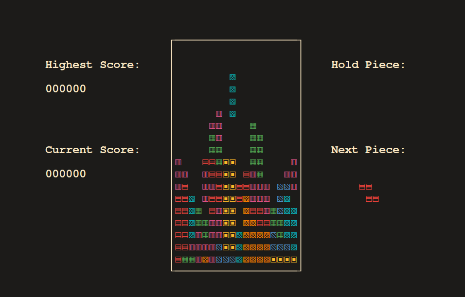

#Note
While FancyTetris is fully functional, it's important to acknowledge that there are some incomplete aspects, particularly concerning Unicode compatibility with ncurses. If you're adept at working with Unicode and ncurses and would like to contribute to improving FancyTetris, your help would be greatly appreciated! Feel free to dive into the code and submit pull requests with your fixes and enhancements. Together, let's make FancyTetris even better!


# Fancy Tetris




Welcome to Fancy Tetris, a stylish and feature-rich Tetris game for Linux with support for Unicode characters, a hold mechanism, and a scoring system with high score saving.


## Features

- Stunning visuals with colorful Unicode characters.
- Engaging gameplay with classic Tetris mechanics.
- Hold mechanism to save a piece for later use.
- Keep track of your progress with a scoring system.
- Save your highest scores for bragging rights.

## Prerequisites

Before you can enjoy the excitement of Fancy Tetris, ensure you have the following installed on your Linux system:

- ncurses library
- C++ compiler (e.g., g++)
- git (for cloning the repository)

## Installation

1. Clone the Fancy Tetris repository:

```bash
git clone https://github.com/yourusername/fancy-tetris.git
